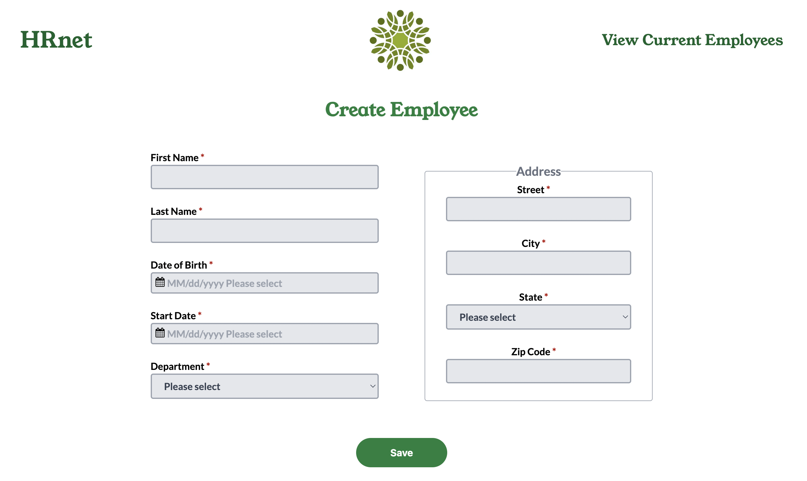
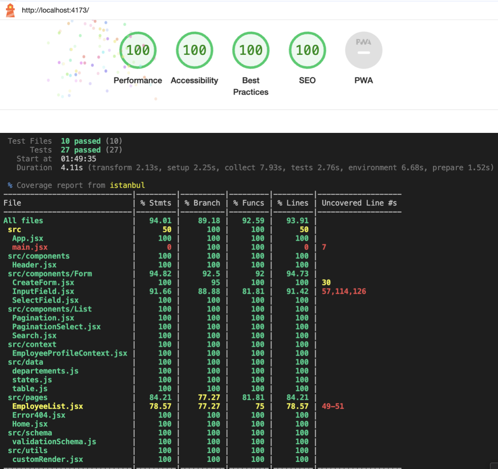

# Projet 14 - HRnet : Convert jQuery library to React

## Installation

Clone this repo :

```bash
$ git clone https://github.com/sfv2010/WealthHealth_P14.git
```

Install npm packages :

```bash
$ npm install
```

Run the project :

```bash
$ npm run dev
```



## Tests


